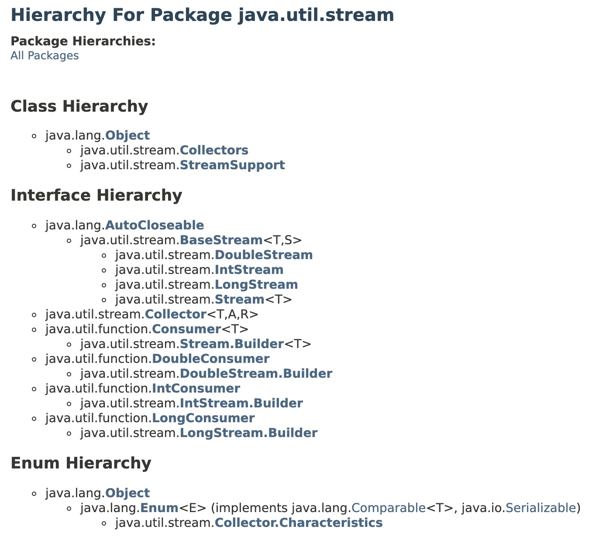

# Complete_Java_Backend


<details>
<Summary>Object oriented Programming Concepts</Summary>
</details>


<details>
<Summary>Exception Handling</Summary>
</details>


<details>
<Summary>Generics</Summary>
</details>


<details>
<Summary>Object class methods(hashCode and equals contract)</Summary>
</details>

<details>
<Summary>Cloning - deep && shallow cloning</Summary>
</details>

<details>
<Summary>Serialization && Deserialization</Summary>
</details>

<details>
<Summary>Wrapper classes, String,StringBuffer and StringBuilder</Summary>
</details>

<details>
<Summary>Collections framework && Comparable, comparator Interfaces</Summary>
</details>


<details>
<Summary>Multithreading</Summary>
</details>


<details>
<Summary>Annotations && Reflection</Summary>
</details>

<details>
<Summary>Java 8 Features</Summary>
<h6>1. Lambda Expressions && Functional Interfaces</h6>


Syntax for lambda expressions

```
1.syntax - No need to add return statement in case of single line expression
(parameters) -> expression

2.Multiple Parameters Lambda
(x) -> x * 2

3.Lambda with No Parameters
(a, b) -> a + b

4.Block Lambda with Multiple Statements
() -> "Hello, World!"

5.Lambda with Method Reference
(x, y) -> {
    int sum = x + y;
    return sum;
}

6.Lambda with Type Declaration
(int x, int y) -> x * y

```

Example of lambda expression

```
@FunctionalInerface
interface Pen{
     void write(); // Single abstract method + any no of abstract and default methods
}

class Bluepen implements Pen{
    public void write(){
        System.out.println("Writing with blue pen....");
    }
}

public class Main {
   public static void main(String[] args) { 
      //Without Lambda expressions
      Bluepen bluePen = new Bluepen();
      takeNotes(bluePen);
      
      //with lambda expressions
      Pen pen = ()->System.out.println("Writing with blue pen....");
      takeNotes(pen);
   }

   public static void takeNotes(Pen pen){
      pen.write();
   }
}
```

<br>
<h6> 2.Method references</h6>

 - method references are a shorthand notation that allows you to refer to a method without actually invoking it
 - They provide a way to pass methods as arguments to functions or assign them to variables, making your code more concise and readable.
 - Method references are often used in functional programming and with features like the Stream API
 - There are four types of method references in Java

```

1.Reference to a Static Method: You can refer to a static method of a class using the class name
// Using a lambda expression
Function<Integer, Double> squareRoot = x -> Math.sqrt(x);

// Using a method reference
Function<Integer, Double> squareRootRef = Math::sqrt;


2.Reference to an Instance Method of a Particular Object: You can reference an instance method of a specific object by specifying the object before the method name.

String str = "Hello, World!";

// Using a lambda expression
Function<Integer, Character> charAt = i -> str.charAt(i);

// Using a method reference
Function<Integer, Character> charAtRef = str::charAt;


3.Reference to an Instance Method of an Arbitrary Object of a Particular Type:
List<String> names = Arrays.asList("Alice", "Bob", "Charlie");

// Using a lambda expression
names.forEach(name -> System.out.println(name));

// Using a method reference
names.forEach(System.out::println);


4.Reference to a Constructor: You can reference a constructor using the Class::new syntax
// Using a lambda expression
Supplier<String> stringSupplier = () -> new String();

// Using a constructor reference
Supplier<String> stringSupplierRef = String::new;

```

<br>
<h6> 3.Predefined Functional Interfaces and there examples</h6>
     - Java provides predefined functional interfaces which are avaliable in java.util.function package


```
import java.util.function.Supplier;

public class FunctionInterfaces {
    public static void main(String[] args) {


      //  1.Supplier  : Represents a supplier of results without taking any input.
        Supplier<String> supplier = () -> "Hello, World!";
        String result = supplier.get();
        System.out.println(result); // Output: Hello, World!


        //2. Consumer : Represents an operation that takes an input argument and returns no result.
        Consumer<String> consumer = message -> System.out.println("Message: " + message);
        consumer.accept("Hello, Consumer!");

        //3.Predicate : Represents a boolean-valued function of one argument.
        Predicate<Integer> isEven = number -> number % 2 == 0;
        boolean result = isEven.test(4);
        System.out.println("Is 4 even? " + result); // Output: Is 4 even? true


        //4.Function : Represents a function that takes an argument of type T and produces a result of type R
        Function<Integer, String> intToString = number -> "Number: " + number;
        String result = intToString.apply(42);
        System.out.println(result); // Output: Number: 42


        // 5..UnaryOperator<T> : Represents an operation on a single operand of type T that produces a result of the same type T.
        UnaryOperator<Integer> square = number -> number * number;
        int result = square.apply(5);
        System.out.println("Square of 5: " + result); // Output: Square of 5: 25

        //6. BinaryOperator<T>: Represents an operation upon two operands of type T that produces a result of the same type T. 
        BinaryOperator<Integer> add = (a, b) -> a + b;
        int result = add.apply(3, 7);
        System.out.println("3 + 7 = " + result); // Output: 3 + 7 = 10

    }
}


```

     


<br>
<h6> 4.Optionals </h6>
     - The Optional class in Java is part of the java.util package and was introduced in Java 8
     - It is used to represent an object that may or may not contain a non-null value
     - The purpose of Optional is to handle scenarios where you have an object that can be null, and it provides a more robust and safe way to work with such values to avoid null pointer exceptions.

```

//1. empty() : Returns an empty Optional instance.
Optional<String> emptyOptional = Optional.empty();


//2. of(T value) : Creates an Optional containing the given non-null value.
Optional<String> nonEmptyOptional = Optional.of("Hello");


//3.ofNullable(T value) : Creates an Optional containing the given value if it's non-null; otherwise, returns an empty Optional.
String nullableValue = null;
Optional<String> optional = Optional.ofNullable(nullableValue); // Creates an empty Optional


//4.isPresent() : Returns true if there is a value present in the Optional, otherwise false.
Optional<String> optional = Optional.of("Hello");
boolean isPresent = optional.isPresent(); // Returns true

//5.ifPresent(Consumer<T> consumer) : Executes the given consumer function if a value is present.
Optional<String> optional = Optional.of("Hello");
optional.ifPresent(value -> System.out.println("Value: " + value)); // Prints "Value: Hello"

//6.orElse(T other) : Returns the value if present; otherwise, returns the specified default value.
Optional<String> optional = Optional.empty();
String result = optional.orElse("Default"); // result will be "Default"


//7.orElseGet(Supplier<T> supplier) : Returns the value if present; otherwise, returns the result of the specified supplier function.
Optional<String> optional = Optional.empty();
String result = optional.orElseGet(() -> "Default"); // result will be "Default"


//8.orElseThrow(Supplier<? extends X> exceptionSupplier) :  Returns the value if present; otherwise, throws an exception generated by the provided supplier.
Optional<String> optional = Optional.empty();
String result = optional.orElseThrow(() -> new NoSuchElementException("No value present"));

//9.map(Function<? super T, ? extends U> mapper) : If a value is present, applies the given mapping function to it and returns an Optional containing the result.
Optional<String> optional = Optional.of("Hello");
Optional<Integer> lengthOptional = optional.map(String::length); // Contains the length, i.e., 5

//10.filter(Predicate<? super T> predicate) : If a value is present and satisfies the given predicate, returns the Optional; otherwise, returns an empty Optional.
Optional<Integer> optional = Optional.of(42);
Optional<Integer> filteredOptional = optional.filter(num -> num > 50); // Returns an empty Optional


```
     

<br>
<h6> 5.Stream Intro, classes and interfaces</h6>


<p align="center">
  
  
</p>

<br>
<h6> 6.Relation ship between stream and functional interfaces</h6>


<br>
<h6> 7.Date and Time API</h6>


</details>


